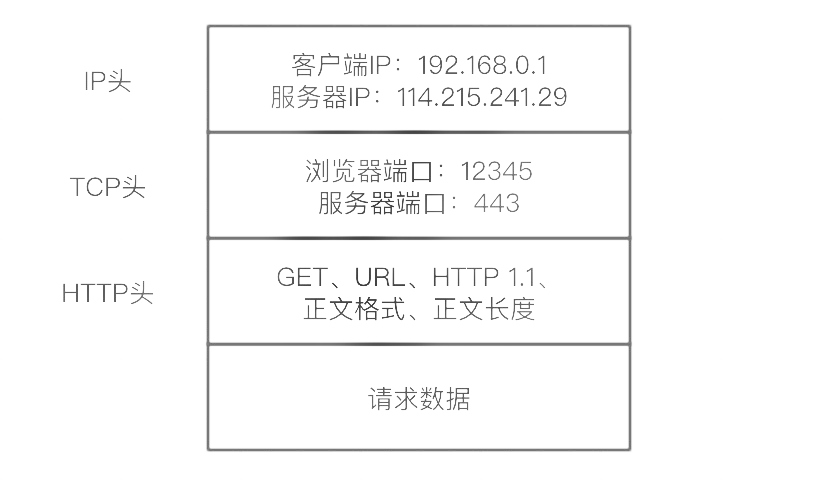

## 计算机网络
### 
 计算机网络体系结构
 

#### 各层作用
   * 应用层：应用层协议定义的是应用进程间通信和交互的规则
   * 运输层：运输层的任务就是负责向`两台主机中进程之间的通信`提供通用的数据传输服务
   * 网络层：把运输层产生的报文段或用户数据报封装成`分组`或`包`进行传送
   * 数据链路层：将网络层交下来的 `IP` 数据报组装成帧，并在两个相邻结点间的链路上传送
   * 物理层：利用物理媒体以`比特`形式传送数据
### 
 一次网络请求的完整生命周期

从客户端发起请求的时候，网络数据流是从上而下的。

要访问这个网站，首先需要在浏览器中输入网站的域名，浏览器并不知道要去哪里访问对应的资源，这个时候就需要用到 DNS 协议对域名进行解析查找的范围依次为：电脑的host文件，DNS缓存中找都没有的话会去在域名注册商（如阿里云旗下的万网）找，那里绑定了域名与对应的服务器IP地址，所以 DNS 就可以通过域名获取到与之绑定的 IP 地址。

知道了目标 IP 地址后，浏览器就开始打包本次请求，这里根据传输数据加密与否分为 HTTP 请求和 HTTPS 请求，使用的分别是 HTTP 协议和 HTTPS 协议，无论使用哪种协议，都要封装请求头和请求参数，以便服务器返回相应的响应：

DNS、HTTP、HTTPS 所在的层是应用层，经过应用层封装后，浏览器将应用层的包交个下一层去完成，这个过程通过 socket 编程来实现。

下一层是传输层，传输层有两种协议，一种是无连接的 UDP 协议，一种是面向连接的 TCP 协议，UDP 无需建立连接即可通信，但是不可靠，可能会丢包，TCP 需要三次握手建立连接，能够保证数据包达到目的地，但是有额外的开销，性能和速度不如 UDP。具体使用哪个协议，需要根据具体需求来定。

对于 HTTP/HTTPS 请求来说，都是基于 TCP 协议的可靠连接，TCP 协议有两个端口，一个是浏览器监听的端口（监听服务器响应），一个是服务器监听的端口（监听客户端请求，对于 HTTP 请求，通常是 80 端口，对于 HTTPS 请求，通常是 443 端口）。操作系统会根据端口来判断，将得到的包转发给哪个进程：

传输层封装完成后，浏览器将包交给操作系统的网络层，网络层的协议是 IP 协议，在这一层，会给传输层传递过来的包加上 IP 头，其中包含源 IP 地址（浏览器所在机器）、目标 IP 地址（服务器所在机器）等信息：

操作系统知道目标机器 IP 地址后，就开始根据它来寻找目标机器，如果是本机局域网内的机器，可以直接通过 IP 地址判断出来，如果是局域网之外的机器，则需要通过网关去外面的世界查找。显然，这里的目标 IP 不在本地局域网。

操作系统启动的时候，就会通过 DHCP 协议配置 IP 地址，以及默认网关的 IP 地址：192.168.1.1。操作系统会通过 ARP 协议通过 IP 地址获取网关的 MAC 地址，并将本地网关和计算机的 MAC 地址添加到 MAC 头中：

这样，操作系统就将 IP 包交给了下一层 —— 链路层，再经由网卡发送出去（客户端机器与网关之间还有物理层的线路连接）。

注：使用网卡（NIC）的情况下，MAC地址会被烧到ROM中，任何一张网卡的MAC地址都是全球唯一的。有人可能会问，有了IP地址为什么还要MAC地址？MAC地址就相当于你的身份证号，一旦出生就写死了，一辈子都不会变，而且具有全局唯一性。IP地址可以动态分配，不能保证全局唯一，只能保证局域网内唯一，相当于你的居住地址，可能过段时间就会。

假设网络包经过多个网关之后，最终到达了目标服务器所在的网关，通过 ARP 协议，目标服务器根据目标 IP 地址返回一个 MAC 地址，表示目标服务器在此，然后网络包通过这个 MAC 地址在服务器所在局域网内找到目标机器。

服务端接收请求的时候，与客户端发送请求相反，网络流是自下而上的。

目标服务器发现与网络请求包的 MAC 地址对上了，取下MAC头，将包传递给上一层网络层，发现 IP 也对上了，就取下 IP 头，然后交给传输层。在传输层里，对于收到的每一个包，都要回复包收到了，这个回复不是此次请求的响应，仅仅是回复包已收到而已，这个回复会沿着包的来路回去。

如果过了一段时间（超时时间），客户端还是没有收到来自服务器的回复，会重新发送这个包，直到收到回复为止。同样，这个重发也不是重新发起上面那个客户端请求，而是传输层将同一个请求反复重试，对用户来说，只有一次请求。

回到目标服务器，当网络包到达传输层后，TCP头中有一个服务器监听端口号，通过这个端口号，可以找到网站正在监听的端口，即 Nginx 中配置的 443 端口，端口对上之后，取下 TCP 头，将网络包交给应用层，开始对 HTTP/HTTPS 请求进行处理。

如果是前端资源的话，直接通过 Nginx 进行响应，如果是 PHP 动态请求的话，再由 Nginx 将请求转发给后台运行的 PHP-FPM 进程进行处理。

当后台服务处理完成后，就会返回一个 HTTPS 的响应包，告知用户请求成功，并返回响应内容，最终在客户端浏览器显示网站首页。

### 
 TCP/UDP主要特点

|  | UDP | TCP |
| :----:| :----: | :----: |
| 连接性 | 无连接 | 面向连接 |
| 可靠性 | 不可靠 | 可靠 |
| 速度 | 无需建立连接，速度较快 | 需要建立连接，速度较慢 |
| 目的主机 | 一对一，一对多，多对一，多对多 | 一对一 |
| 带宽 | UDP 包头较短 | 消耗更多带宽 |
| 消息边界 | 有 | 无 |
| 流量控制 | 无 | 有（滑动窗口） |
| 拥塞控制 | 无 | 有（慢开始，拥塞避免，快重传，快恢复） |
| 资源要求 | 较少 | 较多 |
| 数据顺序 | 不保证 | 保证 |

### 
 TCP,UDP区别以及适用场景

**TCP**：对数据传输的质量有较高要求，但对实时性要求不高。比如HTTP，HTTPS，FTP等传输文件的协议以及POP，SMTP等邮件传输的协议，应选用TCP协议。

**UDP**：只对数据传输的实时性要求较高，但不对传输质量有要求。比如视频传输、实时通信等。比如视频传输、实时通信等，应选用UDP协议。
### 
 三次握手和四次挥手

一开始，客户端和服务端都处于 CLOSED 状态。先是服务端主动监听某个端口，处于 LISTEN 状态。然后客户端主动发起连接 SYN，之后处于 SYN-SENT 状态。服务端收到发起的连接，返回 SYN，并且 ACK 客户端的 SYN，之后处于 SYN-RCVD 状态。客户端收到服务端发送的 SYN 和 ACK 之后，发送 ACK 的 ACK，之后处于 ESTABLISHED 状态，因为它一发一收成功了。服务端收到 ACK 的 ACK 之后，处于 ESTABLISHED 状态，因为它也一发一收了。

### 
 建立TCP为什么要第三次握手
 
这主要是为了防止已失效的连接请求报文段突然又传到了 TCP 服务器，避免产生错误。
已失效的连接请求报文段”的产生在这样一种情况下：client 发出的第一个连接请求报文段并没有丢失，而是在某个网络结点长时间的滞留了（因为网络并发量很大在某结点被阻塞了），以致延误到连接释放以后的某个时间才到达 server。本来这是一个早已失效的报文段。但 server 收到此失效的连接请求报文段后，就误认为是 client 再次发出的一个新的连接请求。于是就向 client 发出确认报文段，同意建立连接。假设不采用“三次握手”，那么只要 server 发出确认，新的连接就建立了。由于现在 client 并没有发出建立连接的请求，因此不会理睬 server 的确认，也不会向 server 发送数据。但 server 却以为新的运输连接已经建立，并一直等待 client 发来数据。这样，server 的很多资源就白白浪费掉了。
采用“三次握手”的办法可以防止上述现象发生。例如刚才那种情况，client 不会向 server 的
确认发出确认。server 由于收不到确认，就知道 client 并没有要求建立连接。主要目的
防止 server 端一直等待，浪费资源。
### 
 TIME-WAIT是什么？为什么必须等待2MLS

TIME-WAIT 是一种 TCP 状态。等待 2MLS（最大报文段的传输时间）可以保证客户端最后一个报文段能够到达服务器，如果未到达，服务器则会超时重传连接释放报文段，使得客户端、服务器都可以正常进入到 CLOSE(关闭) 状态。
### 
DNS主要作用

计算机既可以被赋予 IP 地址，也可以被赋予主机名和域名。用户通常使用主机名或域名来访问对方的计算机，而不是直接通过 IP 地址访问。使用域名的原因是便于记忆。

为了解决上述问题，DNS 服务应运而生。DNS 协议提供通过域名查找 IP 地址，或逆向从 IP 地址反查域名的服务。
### 
GET与POST请求的区别

|  | GET | POST |
| :----:| :----: | :----: |
| 刷新 | 刷新无害 | 数据会被重复提交 |
| 长度限制 | 长度限制2048字符，不同浏览器可能会有差别 | 无限制 |
| 可见性 | 可见 | 不可见 |
| 安全性 | 安全性较差 | 更安全 |
| 缓存 | 可以缓存 | 不可以缓存 |
| 书签 | 可加入书签 | 不可加入书签 |

### 
 HTTP报文组成

HTTP 定义了与服务器交互的不同方法，最基本的方法有 4 种，分别是 GET，POST，PUT，DELETE。URL 全称是资源描述符，我们可以这样认为：一个 URL 地址，它用于描述一个网络上的资源，而 HTTP 中的GET，POST，PUT，DELETE 就对应着对这个资源的查，改，增，删4个操作。
1.GET 用于信息获取，而且应该是安全的 和 幂等的

所谓安全的意味着该操作用于获取信息而非修改信息。换句话说，GET请求一般不应产生副作用。就是说，它仅仅是获取资源信息，就像数据库查询一样，不会修改，增加数据，不会影响资源的状态。

幂等的意味着对同一URL的多个请求应该返回同样的结果。

GET请求报文示例：

    GET /books/?sex=man&name=Professional HTTP/1.1
    Host: www.wrox.com
    User-Agent: Mozilla/5.0 (Windows; U; Windows NT 5.1; en-US; rv:1.7.6)
    Gecko/20050225 Firefox/1.0.1
    Connection: Keep-Alive
2.POST 表示可能修改变服务器上的资源的请求
    
    POST / HTTP/1.1
    Host: www.wrox.com
    User-Agent: Mozilla/5.0 (Windows; U; Windows NT 5.1; en-US; rv:1.7.6)
    Gecko/20050225 Firefox/1.0.1
    Content-Type: application/x-www-form-urlencoded
    Content-Length: 40
    Connection: Keep-Alive
    
    sex=man&name=Professional

从客户端发往服务器的 HTTP 报文称为请求报文(request message)。从服务器发往客户端的报文称为响应报文(response message)。HTTP 请求和响应报文的格式很类似

HTTP 报文组成部分

起始行：报文的第一行就是起始行，在请求报文中用来说明要做些什么，在响应报文中说明出现了什么情况
首部字段：起始行后面有零个或多个首部字段。每个首部字段都包含一个名字和一个值
主体：空行之后就是可选的报文主体了，其中包含了所有类型的数据
### 
HTTP状态码

**状态码分类**
| 状态码 | 分类 | 
| :----:| :----: |
| 1XX | 信息提示 | 
| 2XX | 成功 |
| 3XX | 重定向 | 
| 4XX | 客户端错误 | 
| 5XX | 服务器错误 | 

常见状态码
| 状态码 | 原因 | 
| :----:| :----: |
| 200 | 请求成功 | 
| 301 | 请求的资源永久移动到新的url |
| 304 | 所请求资源未修改 | 
| 400 | 语法错误，无法解析 | 
| 403 | 服务器收到请求，但是拒绝解析 |
| 404 | 请求资源无法找到 | 
| 500 | 服务器内部错区 |
| 502 | 充当网关或代理的服务器，收到无效响应 | 
| 504 | 充当网关或代理的服务器，未及时从远端服务器获取请求 |
| 505 | 不支持请求的HTTP协议版本 | 
### 
HTTPS与HTTP区别

|  | HTTP | HTTPS |
| :----:| :----: | :----: |
| 费用 | 无需额外费用 | 一把免费证书较少，所以需要一定费用 |
| 安全 | 信息一般是明文传输 | 使用安全性较高的ssl/tls加密协议传输 |
| 端口号 | 80 | 443 |
| 刷新 | 刷新无害 | 数据会被重复提交 |
### 
什么是长连接

长连接，指在一个连接上可以连续发送多个数据包，在连接保持期间，如果没有数据包发送，需要双方发链路检测包

