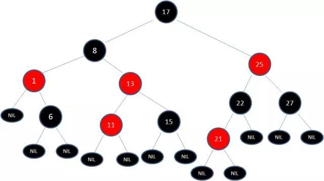

## 数据结构与算法篇

### <div id="算法优劣指标"> 衡量算法优劣的指标</div> 
1. 时间复杂度
1. 空间复杂度（对内存空间的消耗）
1. 算法的稳定性（如果待排序的序列中存在值相等的元素，经过排序之后，相等元素之间原有的先后顺序不变
### <div id="数组"> 数组</div> 
数组(Array)是一种线性表的数据结构，它用一段连续的内存空间，来存储具有相同类型的值。但是由于在PHP的底层定义中，数组是通过散列表实现的，所以这段定义并不适用。PHP的数组可以存储任意数据类型的数据，所以相对于Java来说效率较高。在Java的数组中，每次定义都要先声明属于组的类型，在查找数组时，效率是O(1)，但是在插入和删除时，算法复杂度是O(n),因为在插入操作时，要先找到插入的位置，然后将该位置及往后的元素都往后移一位。删除同理。但是PHP却不受此约束。
### <div id="链表"> 链表</div> 
和数组不同，链表并不需要一块连续的内存空间，它通过“指针”将一组零散的内存块串联起来使用，一般节点有两个属性（data和next）。链表有多种类型，最简单的是单链表。

&nbsp;&nbsp;<div id="单向链表">**&nbsp;&nbsp;单向链表**</div> 


单链表是最原始的链表。单链表有两个节点比较特殊，头结点和尾节点。头结点记录链表的基地址，通过它可以遍历得到整条链表。尾节点的指针不是指向节点，而是指向空地址NUll，表示这是最后一个节点。单向链表插入和删除的时间复杂度是O(1),而查询的时间复杂度是O(n)
疑问：当进行插入和删除操作时要先查询相应节点，查询的时间复杂度是O(n),为什么插入和删除的的复杂度是O(1)呢？可以将插入删除看作是单纯的插入删除，不包含查询在里面。当做两个不同的操作来看待。

&nbsp;&nbsp;<div id="循环链表"> **&nbsp;&nbsp;循环链表**</div> 


在单链表的基础上扩展有了循环链表，循环链表是将尾节点的next指向了头结点，从而实现了收尾相连。可以解决(约瑟夫环)问题。

&nbsp;&nbsp;<div id="双向链表"> **&nbsp;&nbsp;双向链表**</div> 


与单向链表的区别是除了有一个指向下一个节点的指针外，还有一个用于指向上一个节点的指针。从而实现通过O(1)复杂度找到上一个节点。使得双向链表在插入删除是比单向链表更高效。以删除为例，在删除节点时，我们还要获取其前驱节点，让前驱节点的指针指向被删除节点的下一个节点。在单向链表中，获取前驱节点的复杂度是O(n)，但是双向链表O(1)直接获取前驱节点。所以双向链表插入和删除的时间复杂度才是真正的O(1)。
时间复杂度是靠更差的空间复杂度换取的，双向链表始终需要单链表的两倍空间在 Web 应用中，时间效率优先级更高，所以我们通常都是空间换时间来提高性能。
最后一种就是双向循环链表，就是双向链表和单向链表的结合。
### <div id="栈"> 栈</div> 
 限定只能在一端进行插入和删除操作的线性表，并且满足先进后出的特点。我们把允许插入和删除的一端叫做栈顶，另一个端叫做栈底，不含任何数据的栈叫做空栈。栈支持通过数组/链表实现，通过数组实现的通常叫做顺序栈，通过链表实现的叫做链栈。
一般可以使用PHP中array_push()和array_pop()来实现。所以使用较少。

```php
<?php
	class SimpleStack {

	    private $_stack = [];
	    private $_size = [];
	
	    public function __construct($size = 10)
	    {
	        $this->_size = $size;
	    }
	
	    // 获取栈顶元素
	    public function pop()
	    {
	        // 空栈
	        if (count($this->_stack) == 0) {
	            return false;
	        }
	        return array_pop($this->_stack);
	    }
	
	    // 推送元素到栈顶
	    public function push($value)
	    {
	        // 满栈
	        if (count($this->_stack) == $this->_size) {
	            return false;
	        }
	        array_push($this->_stack, $value);
	        return true;
	    }
	
	    public function isEmpty()
	    {
	        // 是否是空栈
	        return current($this->_stack) == false;
	    }
	
	    public function size()
	    {
	        return count($this->_size);
	    }
	}

	$stack = new SimpleStack(15);
	var_dump($stack->isEmpty());  # true
	$stack->push(2);
	$stack->push('aa');
	var_dump($stack->pop());  # aa
	var_dump($stack->size());  # 1
```


### <div id="队列"> 队列</div> 
和栈类似，队列也是一种特殊的线性表结构，只不过队列是在一端插入，另一端删除，就跟我们平常排队一样，从队尾入队，在队头出去，所以队列的特性是先入先出，允许插入的一端叫队尾，允许删除的一端叫队头。队列也可以通过数组和链表实现，通过数组实现的叫顺序队列，通过链表实现的叫做链式队列，栈只需要一个栈顶指针就可以了，因为只允许在栈顶插入删除，但是队列需要两个指针，一个指向队头，一个指向队尾。一般可以使用PHP中array_shift()：删除数组第一个元素和array_push()来实现。
问题:以数组实现队列.

```php
<?php
	class SimpleQueue{
		private $_queue = [];
		private $_size = 0;
		
		public function __construct($size = 10)
		{
		$this->_size = $size;
		}
		
		// 入队
		public function enqueue($value)
		{
		if (count($this->_queue) > $this->_size) {
		return false;
		}
		array_push($this->_queue, $value);
		}
		
		// 出队
		public function dequeue()
		{
		if (count($this->_queue) == 0) {
		return false;
		}
		return array_shift($this->_queue);
		}
		
		public function size()
		{
		return count($this->_queue);
		}
	}

	$queue = new SimpleQueue(5);
	$queue->enqueue(1);
	$queue->enqueue(3);
	$queue->enqueue(6);
	var_dump($queue->dequeue());  # 1
	var_dump($queue->size());  # 2
```
### <div id="体系概述"> 二叉树</div> 
---
####<div id="二叉查找树"> 二叉查找树</div> 
二叉查找树（BST）具备什么特性呢？

1. 左子树上所有结点的值均小于或等于它的根结点的值。
1. 右子树上所有结点的值均大于或等于它的根结点的值。
1. 左、右子树也分别为二叉排序树。

下图中这棵树，就是一颗典型的二叉查找树：


查找的时间复杂度为O(log<sub>2</sub>n)
#### <div id="红黑树"> 红黑树</div> 
如何解决二叉树多次插入新节点导致的不平衡呢？引入红黑树

1. 根节点是红色或黑色。
1. 根节点是黑色。
1. 每个叶子节点都是黑色的空节点（NIL节点）。
1. 每个红色节点的两个子节点都是黑色。(从每个叶子到根的所有路径上不能有两个连续的红色节点)
1. 从任一节点到其每个叶子的所有路径都包含相同数目的黑色节点。

下图中这棵树，就是一颗典型的红黑树：


当插入或者删除节点的时候，红黑树的规则有可能会打破，所以需要做出调整，来继续维持规则。
下面是两个例子：

1.向原红黑树插入值为14的新节点：


由于父节点15是黑色节点，因此这种情况并不会破坏红黑树的规则，无需做任何调整。

2.向原红黑树插入值为21的新节点：


由于父节点22是红色节点，因此这种情况打破了红黑树的规则4（每个红色节点的两个子节点都是黑色），必须进行调整，使之重新符合红黑树的规则。

**变色：**

为了重新符合红黑树的规则，尝试把红色节点变为黑色，或者把黑色节点变为红色。

下图所表示的是红黑树的一部分，需要注意节点25并非根节点。因为节点21和节点22连续出现了红色，不符合规则4，所以把节点22从红色变成黑色：


但这样并不算完，因为凭空多出的黑色节点打破了规则5，所以发生连锁反应，需要继续把节点25从黑色变成红色


此时仍然没有结束，因为节点25和节点27又形成了两个连续的红色节点，需要继续把节点27从红色变成黑色：


**左旋转：**

逆时针旋转红黑树的两个节点，使得父节点被自己的右孩子取代，而自己成为自己的左孩子。如下图：


图中，身为右孩子的Y取代了X的位置，而X变成了自己的左孩子。此为左旋转。

**右旋转：**

顺时针旋转红黑树的两个节点，使得父节点被自己的左孩子取代，而自己成为自己的右孩子。如下图：


图中，身为左孩子的Y取代了X的位置，而X变成了自己的右孩子。此为右旋转。

我们以刚才插入节点21的情况为例：


首先，我们需要做的是变色，把节点25及其下方的节点变色：


此时节点17和节点25是连续的两个红色节点，那么把节点17变成黑色节点？恐怕不合适。这样一来不但打破了规则4，而且根据规则2（根节点是黑色），也不可能把节点13变成红色节点。

变色已无法解决问题，我们把节点13看做X，把节点17看做Y，像刚才的示意图那样进行左旋转：


于根节点必须是黑色节点，所以需要变色，变色结果如下：


因为其中两条路径(17 -> 8 -> 6 -> NIL)的黑色节点个数是4，其他路径的黑色节点个数是3，不符合规则5。
这时候我们需要把节点13看做X，节点8看做Y，像刚才的示意图那样进行右旋转：




最后根据规则来进行变色：


如此一来，我们的红黑树变得重新符合规则。这一个例子的调整过程比较复杂，经历了如下步骤：

变色 -> 左旋转 -> 变色 -> 右旋转 -> 变色
#### <div id="满二叉树">满二叉树</div> 


一颗深度为k且有2^k-1个结点的二叉树称为满二叉树。

除叶子结点外的所有结点均有两个子结点。节点数达到最大值。所有叶子结点必须在同一层上。
#### <div id="完全二叉树">完全二叉树</div> 


若设二叉树的深度为h，除第 h 层外，其它各层 (1～h-1) 的结点数都达到最大个数，第 h 层所有的结点都连续集中在最左边，这就是完全二叉树。

### <div id="二分查找"> 二分查找</div>

对于基于数字索引的数组元素的查找，我们可能第一反应都是遍历这个数组，直到给定数组元素值和待查找的值相等时，返回索引值并退出，否则一直遍历到最后一个元素，如果还是没有找到则返回-1，这样的查找虽然是简单粗暴了点，但是对于规模不大的数据集，也是没什么问题的，但是很明显，对于n个元素的数组，这种查找的时间复杂度是 O(n)，随着数据规模的增加，性能会越来越差，设想如果数据集的长度是40亿（约2的32次方），那么最差的情况需要遍历数组40亿次。

所谓二分查找，针对的是一个有序的数据集合（这点很重要），查找思想有点类似分治思想。每次都通过跟区间的中间元素对比，将待查找的区间缩小为之前的一半，直到找到要查找的元素，或者区间被缩小为0。注意到二分查找针对的必须是已经排序过的有序数组，否则不能使用该算法。

```php
<?php

function binary_search($nums, $num)
{
    return binary_search_internal($nums, $num, 0, count($nums) - 1);
}
function binary_search_internal($nums, $num, $low, $high)
{
    if ($low > $high) {
        return -1;
    }

    $mid = floor(($low + $high) / 2);
    if ($num > $nums[$mid]) {
        return binary_search_internal($nums, $num, $mid + 1, $high);
    } elseif ($num < $nums[$mid]) {
        return binary_search_internal($nums, $num, $low, $mid - 1);
    } else {
        return $mid;
    }
}

$nums = [1, 2, 3, 4, 5, 6];
$index = binary_search($nums, 5);
print $index; 
```
### <div id="冒泡排序"> 冒泡排序</div> 
冒泡排序只会操作相邻的两个数据。每次冒泡操作都会对相邻的两个元素进行比较，看是否满足大小关系要求，如果不满足就让它俩互换。一次冒泡会让至少一个元素移动到它应该在的位置，重复 n 次，就完成了 n 个数据的排序工作。


```php
<?php

/**
 * 冒泡排序实现函数（PHP）
 * @param $nums
 * @return mixed
 */
function bubble_sort($nums) {
    if (count($nums) <= 1) {
        return $nums;
    }
    for ($i = 0; $i < count($nums); $i++) {
        $flag = false;
        for ($j = 0; $j < count($nums) - $i - 1; $j++) {
            if ($nums[$j] > $nums[$j+1]) {
                $temp  = $nums[$j];
                $nums[$j] = $nums[$j+1];
                $nums[$j+1] = $temp;
                $flag = true;
            }
        }
        if (!$flag) {
            break;
        }
    }

    return $nums;
}

$nums = [4, 5, 6, 3, 2, 1];
$nums = bubble_sort($nums);
print_r($nums);
```

代码中对冒泡排序有小小的优化，就是当某一次遍历的时候发现没有需要交换的元素，则认为整个序列已经排序完成。最后我们来看下冒泡排序的性能和稳定性：

1. 时间复杂度： O(n^2) （n的平方）
1. 空间复杂度：只涉及相邻元素的交换，是原地排序算法
1. 算法稳定性：元素相等不会交换，是稳定的排序算法

时间复杂度是 O(n^2)，所以我们在实践中基本不会选用冒泡算法。

### <div id="插入排序"> 插入排序</div> 
原理：我们将数组中的数据分为两个区间，已排序区间和未排序区间。初始已排序区间只有一个元素，就是数组的第一个元素。插入算法的核心思想是取未排序区间中的元素，在已排序区间中找到合适的插入位置将其插入，并保证已排序区间数据一直有序。重复这个过程，直到未排序区间中元素为空，算法结束。


```php
<?php

/**
 * 插入排序实现函数（PHP）
 * @param $nums
 * @return mixed
 */
function insertion_sort($nums) {
    if (count($nums) <= 1) {
        return $nums;
    }

    for ($i = 0; $i < count($nums); $i++) {
        $value = $nums[$i];
        $j = $i - 1;
        for (; $j >= 0; $j--) {
            if ($nums[$j] > $value) {
                $nums[$j+1] = $nums[$j];
            } else {
                break;
            }
        }
        $nums[$j+1] = $value;
    }

    return $nums;
}

$nums = [4, 5, 6, 3, 2, 1];
$nums = insertion_sort($nums);
print_r($nums);
```

插入排序需要两个嵌套的循环，时间复杂度是O(n^2)；没有额外的存储空间，是原地排序算法；不涉及相等元素位置交换，是稳定的排序算法。插入排序的时间复杂度和冒泡排序一样，也不是很理想，但是插入排序不涉及数据交换，从更细粒度来区分，性能要略优于冒泡排序。
### <div id="选择排序"> 选择排序</div> 
算法的实现思路有点类似插入排序，也分已排序区间和未排序区间。但是选择排序每次会从未排序区间中找到最小的元素，将其放到已排序区间的末尾。

```php
<?php

/**
 * 选择排序算法实现
 * @param $nums Array
 * @return $nums
 */
function selection_sort($nums)
{
    if (count($nums) <= 1) {
        return $nums;
    }

    for ($i = 0; $i < count($nums); $i++) {
        $min= $i;
        for ($j = $i + 1; $j < count($nums); $j++) {
            if ($nums[$j] < $nums[$min]) {
                $min = $j;
            }
        }
        if ($min != $i) {
            $temp = $nums[$i];
            $nums[$i] = $nums[$min];
            $nums[$min] = $temp;
        }
    }

    return $nums;
}

$nums = [4, 5, 6, 3, 2, 1];
$nums = selection_sort($nums);
print_r($nums);
```

很显然，选择排序的时间复杂度也是 O(n^2)；由于不涉及额外的存储空间，所以是原地排序；由于涉及非相等元素的位置交换，所以是不稳定的排序算法
### <div id="归并排序"> 归并排序</div> 
我们先把数组从中间分成前后两部分，然后对前后两部分分别排序，再将排好序的两部分合并在一起，这样整个数组就都有序了。

```php
<?php
function merge_sort($nums)
{
    if (count($nums) <= 1) {
        return  $nums;
    }

    merge_sort_c($nums, 0, count($nums) - 1);
    return $nums;
}

function merge_sort_c(&$nums, $p, $r)
{
    if ($p >= $r) {
        return;
    }

    $q = floor(($p + $r) / 2);
    merge_sort_c($nums, $p, $q);
    merge_sort_c($nums, $q + 1, $r);

    merge($nums, ['start' => $p, 'end' => $q], ['start' => $q + 1, 'end' => $r]);
}
  function merge(&$nums, $nums_p, $nums_q)
{
    $temp = [];
    $i = $nums_p['start'];
    $j = $nums_q['start'];
    $k = 0;
    while ($i <= $nums_p['end'] && $j <= $nums_q['end']) {
        if ($nums[$i] <= $nums[$j]) {
            $temp[$k++] = $nums[$i++];
        } else {
            $temp[$k++] = $nums[$j++];
        }
    }

    if ($i <= $nums_p['end']) {
        for (; $i <= $nums_p['end']; $i++) {
            $temp[$k++] = $nums[$i];
        }
    }

    if ($j <= $nums_q['end']) {
        for (; $j <= $nums_q['end']; $j++) {
            $temp[$k++] = $nums[$j];
        }
    }

    for ($x = 0; $x < $k; $x++) {
        $nums[$nums_p['start'] + $x] = $temp[$x];
    }
}

$nums = [4, 5, 6, 3, 2, 1];
$nums = merge_sort($nums);
print_r($nums);
```

归并排序不涉及相等元素位置交换，是稳定的排序算法，时间复杂度是 O(nlogn)，要优于 O(n^2)，但是归并排序需要额外的空间存放排序数据，不是原地排序，最多需要和待排序数组同样大小的空间，所以空间复杂度是 O(n)。
### <div id="快速排序"> 快速排序</div> 
如果要排序数组中下标从 p 到 r 之间的一组数据，我们选择 p 到 r 之间的任意一个数据作为 pivot（分区点）。

我们遍历 p 到 r 之间的数据，将小于 pivot 的放到左边，将大于 pivot 的放到右边，将 pivot 放到中间。经过这一步骤之后，数组 p 到 r 之间的数据就被分成了三个部分，前面 p 到 q-1 之间都是小于 pivot 的，中间是 pivot，后面的 q+1 到 r 之间是大于 pivot 的。

```php
<?php

function quick_sort($nums)
{
    if (count($nums) <= 1) {
        return $nums;
    }

    quick_sort_c($nums, 0, count($nums) - 1);
    return $nums;
}

function quick_sort_c(&$nums, $p, $r)
{
    if ($p >= $r) {
        return;
    }

    $q = partition($nums, $p, $r);
    quick_sort_c($nums, $p, $q - 1);
    quick_sort_c($nums, $q + 1, $r);
}
 function partition(&$nums, $p, $r)
{
    $pivot = $nums[$r];
    $i = $p;
    for ($j = $p; $j < $r; $j++) {
        // 原理：将比$pivot小的数丢到[$p...$i-1]中，剩下的[$i..$j]区间都是比$pivot大的
        if ($nums[$j] < $pivot) {
            $temp = $nums[$i];
            $nums[$i] = $nums[$j];
            $nums[$j] = $temp;
            $i++;
        }
    }

    // 最后将 $pivot 放到中间，并返回 $i
    $temp = $nums[$i];
    $nums[$i] = $pivot;
    $nums[$r] = $temp;

    return $i;
}

$nums = [4, 5, 6, 3, 2, 1];
$nums = quick_sort($nums);
print_r($nums);
```

快速排序是原地排序算法，时间复杂度和归并排序一样，也是O(nlogn)，这个时间复杂度数据量越大，越优于O(n^2)，但是快速排序也有其缺点，因为涉及到数据的交换，有可能破坏原来相等元素的位置排序，所以是不稳定的排序算法。尽管如此，凭借其良好的时间复杂度表现和空间复杂度的优势，快速排序在工程实践中应用较多，比如 PHP 数组的 sort 函数底层就是基于快速排序来实现的。
