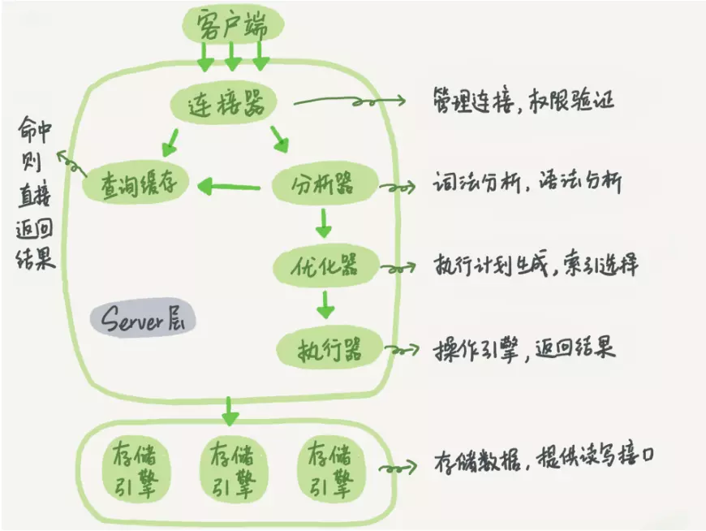

## MySQL

### 
 体系结构
 

MySQL体系架构 可以分为 Server 层和存储引擎层两部分。

**Server层**:连接器，查询缓存，分析器，优化器，执行器

**存储引擎层**：存储数据，提供读写接口
### 
 SQL语句怎么执行的
 
第一步: 连接器
用户名密码登录，连接器会到权限表里面查出你拥有的权限。之后，这个连接里面的权限判断逻辑，都将依赖于此时读到的权限。(成功建立连接后，即使管理员账号对这个用户的权限做了修改，也不会影响已经存在连接的权限)

第二步: 分析器
开始真正执行语句了。需要对 SQL 语句做解析。包括分析语法是否正确，数据表是否存在相应字段等。

第三步:优化器
经过了分析器，MySQL 就知道你要做什么了。MySQL 要决定好怎么样做最优.
表里面有多个索引的时候，决定使用哪个索引；选用一条最优方式执行。

第四步: 执行器
开始执行语句。要先判断一下你对这个表有没有执行的权限，如果有权限,打开表继续执行。
打开表的时候，根据表的引擎定义，去使用这个引擎提供的接口。
### 
 基础操作语句
 

|操作|命令|
|:----:|:----:|
|创建数据库|	CREATE DATABASE 数据库名；|
|指定要操作的数据库|USE 数据库名；|
|创建数据表	|CREATE TABLE 数据表名；|
|查看数据表	|SHOW CREATE TABLE 数据表名；|
|为数据表重命名|	ALTER TABLE 数据表名 RENAME 新表名；|
|修改字段名	|ALTER TABLE 数据表名 CHANGE 旧字段名 新字段名 新数据类型；|
|修改字段数据类型	|ALTER TABLE 数据表名 MODIFY 字段名 数据类型；|
|添加字段|	ALTER TABLE 数据表名 ADD 字段名 数据类型；|
|删除字段	|ALTER TABLE 表名 DROP 字段名；|
|删除数据表	|DROP TABLE 数据表名；|

#### CRUD

|操作|命令|
|:----:|:----:|
|insert|INSERT INTO table_name (column1,column2) VALUES (value1,value2); |
|DELETE|DELETE FROM table_name WHERE some_column=some_value;|
|UPDATE|UPDATE table_name SET column1=value1,column2=value2 WHERE some_column=some_value; |
|SELECT|SELECT column_name,column_name FROM table_name; |

### 
 数据库设计原则
 
**数据库设计范式**

  - 第一范式：属性具有原子性，不可再分解，即不能表中有表
  - 第二范式：唯一性约束，每条记录有唯一标示，所有的非主键字段均需依赖于主键字段
  - 第三范式：冗余性约束，非主键字段间不能相互依赖

**数据库设计原则**

  - 避免冗余属性，冗余属性会带来数据不一致性
  - 一个表只存储它应该存储的信息，和此表无关的信息放到另一个表去存储，表之间尽量解耦
  - 一个字段中不要出现分隔符，或者在一个字段中存储多个信息
### 
 CHAR 和VARCHAR 区别

char：存储长度相对固定的值。比如 type、ip 地址或 md5 之类的数据。

varchar：保存可变长度字符串。如文本内容。
### 
 LEFT JOIN,RIGHT JOIN,INNER JOIN
 
- LEFT JOIN(左连接)：获取左表所有记录，即使右表没有对应匹配的记录
- RIGHT JOIN(右连接)： 与 LEFT JOIN 相反，用于获取右表所有记录，即使左表没有对应匹配的记录
- INNER JOIN(内连接)：获取两个表中字段匹配关系的记录
### 
 常用的MySQL函数
 
**数学函数**

floor(x) 返回不大于 x 的最大整数值

ceil/ceiling(x) 返回不小于 x 的最小整数

round(x) 四舍五入

rand() 随机函数[0, 1)

abs(x) 返回 x 的绝对值

**字符串函数**

concat(str1, str2, ...) 将参数连接成字符串返回

length(str) 返回字符串长度

**日期和时间函数**

now() 当前时间

curdate() 当前日期

SELECT UNIX_TIMESTAMP('2019-05-07 22:55:00'); #1557240900

SELECT FROM_UNIXTIME(1557240900); #2019-05-07 22:55:00

**系统信息函数**

VERSION() 返回数据库的版本号

LAST_INSERT_ID() 返回最后生成的 AUTO_INCREMENT 值

**加密函数**

PASSWORD(str) 对字符串 str 进行加密

MD5(str) 对字符串 str 进行加密

**格式化函数**

FORMAT(x, n) 可以将数字 x 进行格式化，保留到小数点后 n 位，四舍五入

SELECT FORMAT(2.7895, 2); #2.79

### 
 锁
 
**用途**
多个查询需要在同一时刻修改数据，会产生并发控制的问题。使用锁可以有效解决这个问题

#### **读写锁**
共享锁：同一时刻可以同时读取同一个资源
排他锁：一个写锁会阻塞其他的写锁和读锁
#### 锁粒度
表锁：开销最小，对表进行写操作，需要获得写锁，会阻塞该表的所有读写操作
行级锁：最大锁开销，可以最大程度地支持并发处理
#### 乐观锁
#### 悲观锁
### 
 事物
 
事务就是一组原子性的 SQL 查询，或者说一个独立的工作单元。事务内的语句，要么全部执行成功，要么全部执行失败

ACID 特性：原子性(atomicity)、一致性(consistency)、隔离性(isolation)、持久性(durability)

- 原子性(A)：事务是最小单位，不可再分
- 一致性(C)：事务要求所有的DML语句操作的时候，必须保证同时成功或者同时失败
- 隔离性(I)：事务A和事务B之间具有隔离性
- 持久性(D)：是事务的保证，事务终结的标志(内存的数据持久到硬盘文件中)

### 
 MYISAM和INNODB
 
#### InnoDB
- 支持事务，行级锁，删除或者增加索引时不需要复制全表数据
- InnoDB 采用 MVCC 来支持高并发，实现了四个标准的隔离级别
- InnoDB 表是基于聚族索引建立的，聚族索引对主键查询有很高的性能
- InnoDB 内部做了很多优化，包括可预测性预读，加速读操作的自适应哈希索引，加速插入操作的插入缓冲区
- 作为事务性的存储引擎，InnoDB 通过一些机制和工具支持真正的热备份
#### MyISAM
- 不支持事务和行级锁，崩溃后无法安全恢复，表锁非常影响性能
- MyISAM 对整张表加锁，而不是针对行。读取时对需要读到的表加共享锁，写入则加排它锁。在表有读取查询的同事，也可以插入新记录(支持并发插入)
- 支持延迟更新索引健，极大的提升写入性能
- 支持全文索引，可以支持复杂的查询
- MyISAM 将表存储在两个文件中，数据文件和索引文件
### 
 常见索引
 
#### 索引区别
- 普通索引：最基本的索引，没有任何限制
- 唯一索引：与"普通索引"类似，不同的就是：索引列的值必须唯一，但允许有空值
- 主键索引：它是一种特殊的唯一索引，不允许有空值
- 全文索引：仅可用于 MyISAM 表，针对较大的数据，生成全文索引很耗时好空间
- 组合索引：为了更多的提高 MySQL 效率可建立组合索引，遵循"最左前缀"原则
### 
 BTree+
 
MySQL中的 BTree+
在经典 BTree+ 的基础上进行了优化，增加了顺序访问指针。在 BTree+ 的每个叶子节点增加了一个指向相邻叶子节点的指针，形成了带顺序访问指针的 BTree+，提高了区间访问性能。
#### 为什么采用BTree+ 作为索引？
**加快查询效率的有三种数据结构：数组，hash，和二叉树。**

- 为什么不用数组：数组查询速度很快，但是数据的增，删会使得后面的元素都要移动，所以不推荐。
- 为什么不用hash：因为hash是无序的，对于查询区间效率很差。
- 二叉树：在二叉树的基础上引申，增加树的分支，可以是n叉树，用来降低树的深度，最下面一层用链表连接起来，更快的获取数据。

