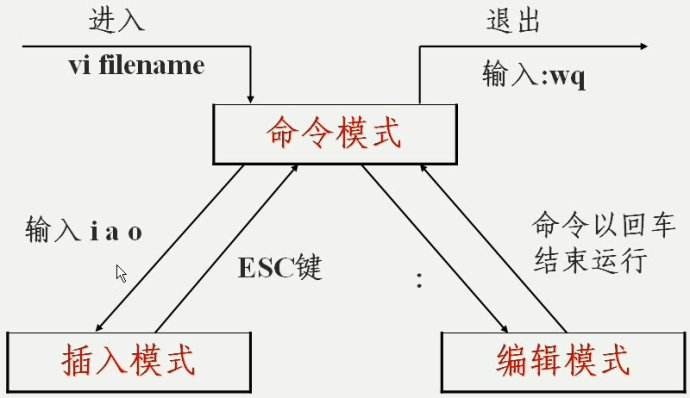
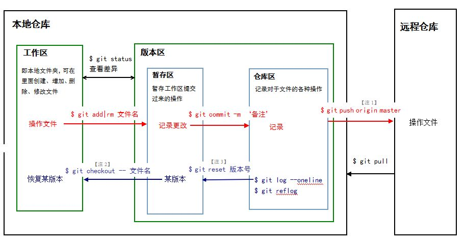

## Linux篇
---
### 
 Linux 基础命令
 

| 命令 | 示例 | 功能 |备注
| :----:| :----: | :----: |:----:
| ls | 列出文件和目录信息 | ls -l |列出当前目录文件信息
| cd | 改变当前路径 | cd /etc | 转到/etc去
| pwd |  显示当前路径|pwd |显示当前路径
| cp |拷贝文件  | 1：cp file1 file2 2:cp file1/ file2 -r |1: 拷贝 file1 为 file2 2: 拷贝 dir1.0/为 dir2.0/
| mv | 移动或重命名文件| 1: mv file1 file2  2: mv file dir/ |1: 改 file1 名字为 file2 2: 将 file 移动到 dir/去
| rm |删除文件  | 1: rm file 2: rm dir/ -r |1:  删除 file 2:  递归地删除 dir/
| ps | 查看系统进程信息 | ps -ef   |查看系统进程信息
| diff | 比较两文件的异同 | diff file1 file2 -uN |比较 file1 和 file2
| mkdir |创建目录  | mkdir dir/ |创建新目录 dir/
| touch |  创建文件| touch a.txt |创建文件a.txt
|wc|计算文件的行数(l)、单词数(w)、字符数(c)|wc test.c|显示行数(l)、单词数(w)、字符数(c) 文件名
### 
 文件查找
 
**find命令**，find 命令会递归地查找你所执行的目录下的所有子目录。find 命令除了可以按照文件的名字来查找，还可以按文件的权限、文件的类型、文件的索 引节点编号等等来查找。

**grep命令**，用来在文件中查找字符串。命令格式：grep   寻找的内容  寻找的路径 -参数

**总结就是find命令根据文件属性查找，grep根据内容查找**        
### 
 权限命令
 
假如使用`ls -l`命令后显示内容如下：
> -rwxrw-r‐-1 root root 1213 Feb 2 09:39 abc

- 10个字符确定不同用户能对文件干什么

- 第一个字符代表文件（-）、目录（d），链接（l）

- 其余字符每3个一组（rwx），读（r）、写（w）、执行（x）

- 第一组rwx：文件所有者的权限是读、写和执行

- 第二组rw-：与文件所有者同一组的用户的权限是读、写但不能执行

- 第三组r--：不与文件所有者同组的其他用户的权限是读不能写和执行

也可用数字表示为：r=4，w=2，x=1  因此rwx=4+2+1=7

- 1 表示连接的文件数

- root 表示用户

- root表示用户所在的组

- 1213 表示文件大小（字节）

- Feb 2 09:39 表示最后修改日期

- abc 表示文件名

**改变权限的命令**

chmod 改变文件或目录的权限

chmod 755 abc：赋予abc权限rwxr-xr-x

chmod u=rwx，g=rx，o=rx abc：同上u=用户权限，g=组权限，o=不同组其他用户权限(u=user,g=group,o=other)

chmod u-x，g+w abc：给abc去除用户执行的权限，增加组写的权限

chmod a+r abc：给所有用户添加读的权限
### 
 crontab 定时任务
 
**crontab命令格式：**

{minute} {hour} {day-of-month} {month} {day-of-week} {full-path-to-shell-script}

  * minute: 区间为 0 – 59

  * hour: 区间为0 – 23

  * day-of-month: 区间为0 – 31

  * month: 区间为1 – 12. 1 是1月. 12是12月.

  * Day-of-week: 区间为0 – 7. 周日可以是0或7.

在以上各个字段中，还可以使用以下特殊字符：

星号（*）：代表所有可能的值，例如month字段如果是星号，则表示在满足其它字段的制约条件后每月都执行该命令操作。

逗号（,）：可以用逗号隔开的值指定一个列表范围，例如，“1,2,5,7,8,9”

中杠（-）：可以用整数之间的中杠表示一个整数范围，例如“2-6”表示“2,3,4,5,6”

正斜线（/）：可以用正斜线指定时间的间隔频率，例如“0-23/2”表示每两小时执行一次。同时正斜线可以和星号一起使用，例如*/10，如果用在minute字段，表示每十分钟执行一次。

### 
 Vim
 
 vi编辑器的键盘输入分成两种情况，一种情况下你的输入就是你编辑的文档，另一种情况下你的输入是你要编辑器帮你完成的动作。

### 
 shell 编程
 

## Git篇
---

 git
 

git clone 项目地址    克隆项目到本地

git config -l 查看配置文件

git remote add upstream 主仓库地址（新建远程库的别名）

git pull upstream dev（git pull 主仓库别名 主仓库分支名）  //pull远程主仓库

git add 加入暂存区

git commit -m 'ino' 仓库区

git push 提交到远程仓库

**注意：我们每次pull是从主仓库拉取代码，push是推送到自己的代码仓库，然后提交合并请求**
# 扩展阅读
[Git教程廖雪峰](https://www.liaoxuefeng.com/wiki/896043488029600)
