## 架构篇
### 
 如何让系统支持高并发
 
##### 先从最简单的系统架构说起：

假设刚开始你的系统部署在一台机器上，连接了一台数据库，数据库部署在一台服务器上。

我们甚至可以再现实点，给个例子，你的系统部署的机器是 4 核 8G，数据库服务器是 16 核 32G。

此时假设你的系统用户量总共就 10 万，用户量很少，每天活跃的用户就 1 万。

按照 28 法则，每天高峰期算他 4 个小时，高峰期活跃的用户占比达到 80%，就是 8000 人活跃在 4 小时内。

然后每个人对你的系统发起的请求，我们算他每天是 20 次吧。那么高峰期 8000 人发起的请求也才 16 万次，平均到 4 小时内的每秒（14400 秒），每秒也就 10 次请求。

好吧！完全跟高并发搭不上边，对不对？

然后系统层面每秒是 10 次请求，对数据库的调用每次请求都会好几次数据库操作的，比如做做 crud 之类的。

那么我们取一个一次请求对应 3 次数据库请求吧，那这样的话，数据库层每秒也就 30 次请求，对不对？

按照这台数据库服务器的配置，支撑是绝对没问题的。

上述描述的系统，用一张图表示，就是下面这样：

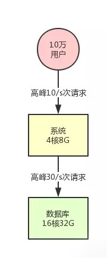

##### 系统集群化部署

假设此时你的用户数开始快速增长，比如注册用户量增长了 50 倍，上升到了 500 万。

此时日活用户是 50 万，高峰期对系统每秒请求是 500/s。然后对数据库的每秒请求数量是 1500/s，这个时候会怎么样呢？

按照上述的机器配置来说，如果你的系统内处理的是较为复杂的一些业务逻辑，是那种重业务逻辑的系统的话，是比较耗费 CPU 的。

此时，4 核 8G 的机器每秒请求达到 500/s 的时候，很可能你会发现你的机器 CPU 负载较高了。

然后数据库层面，以上述的配置而言，其实基本上 1500/s 的高峰请求压力的话，还算可以接受。

这个主要是要观察数据库所在机器的磁盘负载、网络负载、CPU 负载、内存负载，按照我们的线上经验而言，那个配置的数据库在 1500/s 请求压力下是没问题的。

所以此时你需要做的一个事情，首先就是要支持你的系统集群化部署。

你可以在前面挂一个负载均衡层，把请求均匀打到系统层面，让系统可以用多台机器集群化支撑更高的并发压力。

比如说这里假设给系统增加部署一台机器，那么每台机器就只有 250/s 的请求了。

这样一来，两台机器的 CPU 负载都会明显降低，这个初步的 “高并发” 不就先 cover 住了吗？

要是连这个都不做，那单台机器负载越来越高的时候，极端情况下是可能出现机器上部署的系统无法有足够的资源响应请求了，然后出现请求卡死，甚至系统宕机之类的问题。

所以，简单小结，第一步要做的：

添加负载均衡层，将请求均匀打到系统层。

系统层采用集群化部署多台机器，扛住初步的并发压力。

此时的架构图变成下面的样子：

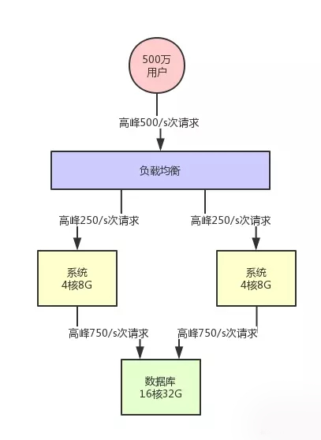

##### 数据库分库分表 + 读写分离

假设此时用户量继续增长，达到了 1000 万注册用户，然后每天日活用户是 100 万。

那么此时对系统层面的请求量会达到每秒 1000/s，系统层面，你可以继续通过集群化的方式来扩容，反正前面的负载均衡层会均匀分散流量过去的。

但是，这时数据库层面接受的请求量会达到 3000/s，这个就有点问题了。

此时数据库层面的并发请求翻了一倍，你一定会发现线上的数据库负载越来越高。

每次到了高峰期，磁盘 IO、网络 IO、内存消耗、CPU 负载的压力都会很高，大家很担心数据库服务器能否抗住。

没错，一般来说，对那种普通配置的线上数据库，建议就是读写并发加起来，按照上述我们举例的那个配置，不要超过 3000/s。
因为数据库压力过大，首先一个问题就是高峰期系统性能可能会降低，因为数据库负载过高对性能会有影响。

另外一个，压力过大把你的数据库给搞挂了怎么办？

所以此时你必须得对系统做分库分表 + 读写分离，也就是把一个库拆分为多个库，部署在多个数据库服务上，这是作为主库承载写入请求的。

然后每个主库都挂载至少一个从库，由从库来承载读请求。

此时假设对数据库层面的读写并发是 3000/s，其中写并发占到了 1000/s，读并发占到了 2000/s。

那么一旦分库分表之后，采用两台数据库服务器上部署主库来支撑写请求，每台服务器承载的写并发就是 500/s。每台主库挂载一个服务器部署从库，那么 2 个从库每个从库支撑的读并发就是 1000/s。

简单总结，并发量继续增长时，我们就需要 focus 在数据库层面：分库分表、读写分离。

此时的架构图如下所示：

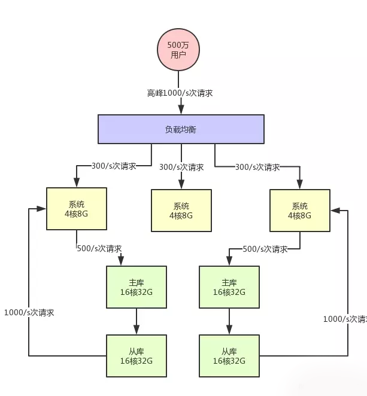

##### 缓存集群引入

接着就好办了，如果你的注册用户量越来越大，此时你可以不停的加机器，比如说系统层面不停加机器，就可以承载更高的并发请求。

然后数据库层面如果写入并发越来越高，就扩容加数据库服务器，通过分库分表是可以支持扩容机器的，如果数据库层面的读并发越来越高，就扩容加更多的从库。

但是这里有一个很大的问题：数据库其实本身不是用来承载高并发请求的，所以通常来说，数据库单机每秒承载的并发就在几千的数量级，而且数据库使用的机器都是比较高配置，比较昂贵的机器，成本很高。

如果你就是简单的不停的加机器，其实是不对的。

所以在高并发架构里通常都有缓存这个环节，缓存系统的设计就是为了承载高并发而生。

所以单机承载的并发量都在每秒几万，甚至每秒数十万，对高并发的承载能力比数据库系统要高出一到两个数量级。

所以你完全可以根据系统的业务特性，对那种写少读多的请求，引入缓存集群。

具体来说，就是在写数据库的时候同时写一份数据到缓存集群里，然后用缓存集群来承载大部分的读请求。

这样的话，通过缓存集群，就可以用更少的机器资源承载更高的并发。

比如说上面那个图里，读请求目前是每秒 2000/s，两个从库各自抗了 1000/s 读请求，但是其中可能每秒 1800 次的读请求都是可以直接读缓存里的不怎么变化的数据的。

那么此时你一旦引入缓存集群，就可以抗下来这 1800/s 读请求，落到数据库层面的读请求就 200/s。

同样，给大家来一张架构图，一起来感受一下：

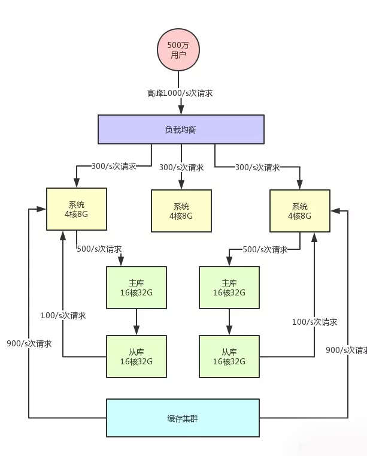

按照上述架构，他的好处是什么呢？

可能未来你的系统读请求每秒都几万次了，但是可能 80%~90% 都是通过缓存集群来读的，而缓存集群里的机器可能单机每秒都可以支撑几万读请求，所以耗费机器资源很少，可能就两三台机器就够了。

你要是换成是数据库来试一下，可能就要不停的加从库到 10 台、20 台机器才能抗住每秒几万的读并发，那个成本是极高的。
好了，我们再来简单小结，承载高并发需要考虑的第三个点：

不要盲目进行数据库扩容，数据库服务器成本昂贵，且本身就不是用来承载高并发的
针对写少读多的请求，引入缓存集群，用缓存集群抗住大量的读请求

##### 引入消息中间件集群

接着再来看看数据库写这块的压力，其实是跟读类似的。

假如说你所有写请求全部都落地数据库的主库层，当然是没问题的，但是写压力要是越来越大了呢？

比如每秒要写几万条数据，此时难道也是不停的给主库加机器吗？

可以当然也可以，但是同理，你耗费的机器资源是很大的，这个就是数据库系统的特点所决定的。

相同的资源下，数据库系统太重太复杂，所以并发承载能力就在几千 /s 的量级，所以此时你需要引入别的一些技术。

比如说消息中间件技术，也就是 MQ 集群，他是非常好的做写请求异步化处理，实现削峰填谷的效果。

假如说，你现在每秒是 1000/s 次写请求，其中比如 500 次请求是必须请求过来立马写入数据库中的，但是另外 500 次写请求是可以允许异步化等待个几十秒，甚至几分钟后才落入数据库内的。

那么此时你完全可以引入消息中间件集群，把允许异步化的每秒 500 次请求写入 MQ，然后基于 MQ 做一个削峰填谷。比如就以平稳的 100/s 的速度消费出来然后落入数据库中即可，此时就会大幅度降低数据库的写入压力。

此时，架构图变成了下面这样：

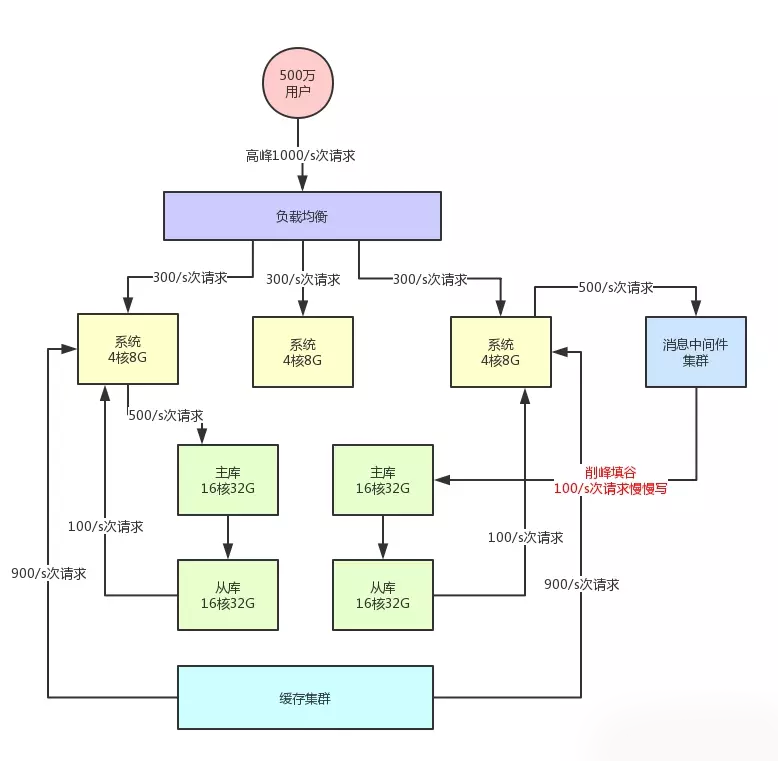

大家看上面的架构图，首先消息中间件系统本身也是为高并发而生，所以通常单机都是支撑几万甚至十万级的并发请求的。

所以，他本身也跟缓存系统一样，可以用很少的资源支撑很高的并发请求，用他来支撑部分允许异步化的高并发写入是没问题的，比使用数据库直接支撑那部分高并发请求要减少很多的机器使用量。

而且经过消息中间件的削峰填谷之后，比如就用稳定的 100/s 的速度写数据库，那么数据库层面接收的写请求压力，不就成了 500/s + 100/s = 600/s 了么？

大家看看，是不是发现减轻了数据库的压力？

到目前为止，通过下面的手段，我们已经可以让系统架构尽可能用最小的机器资源抗住了最大的请求压力，减轻了数据库的负担。
系统集群化

数据库层面的分库分表 + 读写分离

针对读多写少的请求，引入缓存集群

针对高写入的压力，引入消息中间件集群，

初步来说，简单的一个高并发系统的阐述是说完了。

但是，其实故事到这里还远远没有结束。

首先，高并发这个话题本身是非常复杂的，远远不是一些文章可以说的清楚的，他的本质就在于，真实的支撑复杂业务场景的高并发系统架构其实是非常复杂的。

比如说每秒百万并发的中间件系统、每日百亿请求的网关系统、瞬时每秒几十万请求的秒杀大促系统、支撑几亿用户的大规模高并发电商平台架构，等等。

为了支撑高并发请求，在系统架构的设计时，会结合具体的业务场景和特点，设计出各种复杂的架构，这需要大量底层技术支撑，需要精妙的架构和机制设计的能力。

最终，各种复杂系统呈现出来的架构复杂度会远远超出大部分没接触过的同学的想象。

其次，高并发这话题本身包含的内容也远远不止本文说的这么几个 topic：分库分表、缓存、消息。

一个完整而复杂的高并发系统架构中，一定会包含各种复杂的自研基础架构系统、各种精妙的架构设计（比如热点缓存架构设计、多优先级高吞吐 MQ 架构设计、系统全链路并发性能优化设计，等等）、还有各种复杂系统组合而成的高并发架构整体技术方案、还有 NoSQL（Elasticsearch 等）/ 负载均衡 / Web 服务器等相关技术。

所以大家切记要对技术保持敬畏之心，这些东西都很难通过一些文章来表述清楚。

最后，真正在生产落地的时候，高并发场景下你的系统会出现大量的技术问题。

比如说消息中间件吞吐量上不去需要优化、磁盘写压力过大性能太差、内存消耗过大容易撑爆、分库分表中间件不知道为什么丢了数据，等等吧。

诸如此类的问题非常多，这些也不可能通过文章给全部说清楚。

顺着本文的思路继续思考下去，结合你自己熟悉和知道的一些技术继续思考。

比如说，你熟悉 Elasticsearch 技术，那么你就可以思考，唉？在高并发的架构之下，是不是可以通过分布式架构的 ES 技术支撑高并发的搜索？

参考来源[石杉的架构笔记](https://juejin.im/post/5c45aaee6fb9a049e6609115)

## nginx配置
>如何实现服务器之间的协同功能呢？

通过 Nginx 提供的反向代理和负载均衡功能，可以合理的完成业务的分配，提高网站的处理能力；同时利用缓存功能，还可以将不需要实时更新的动态页面输出结果，转化为静态网页形成缓存，从而提高网站的响应速度。

### 
正向代理，目标服务器不知道谁在访问
 
位于客户端和目标服务器之间，起到一个中转的作用。其实就是客户端想访问目标服务器，但是因为某些原因不能够直接访问，则把请求和目标服务器发给代理服务器，代理服务器再去请求目标服务器，把返回的响应结果返回给客户端。

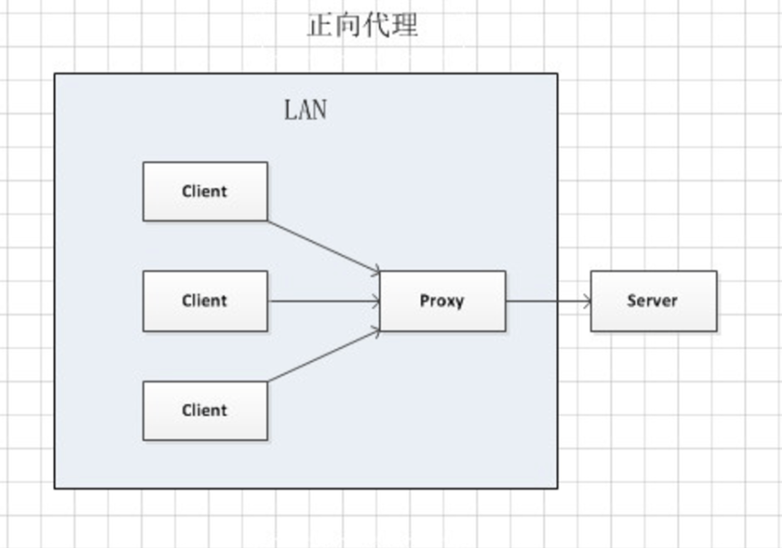
### 
反向代理，用户实际并不知道最终服务器，而是访问一个反向代理服务器
 
客户端会把反向代理服务器当成目标服务器，向反向代理服务器发送请求后，反向代理服务器再请求内部的后端服务器，把得到的响应结果返回给客户端。
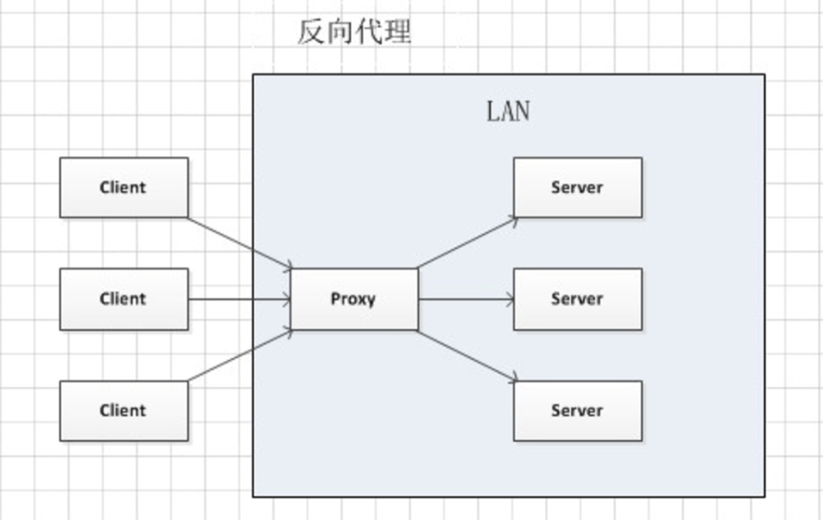
#### 特性：

  - 安全性。反向代理具有安全性。能隐藏真实的内部服务器。
  - 功能性。正向代理主要用途是为防火墙内的局域网用户提供访问外网的途径。反向代理主要用途是将防火墙内的服务器提供给外边的用户访问，同时也可以为多个后端服务器提供负载均衡功能、缓存功能等。
#### 反向代理服务配置
在 Nginx 配置文件中的 location 块中，这是 proxy_pass ` 指令。

	server{
	listen 80;
	  server_name test.com;
	  #将本机接收到的test.com的请求全部转发到另外一台服务器192.168.78.122
	  location /{
	    proxy_pass http://192.168.78.122; 
	    #下面是其他辅助指令
	    proxy_set_header Host $host; #更改来自客户端的请求头信息
	    proxy_set_header X-Real_IP $remote_addr;    #用户真实访问ip
	    proxy_connect_timeout 2; #配置nginx与后端服务器建立连接的超时时间
	    proxy_read_timeout 2; #配置nginx向后端发出read请求的等待响应超时时间
	    proxy_send_timeout 2; #配置nginx向后端服务器发出write请求的等待响应超时时间
	    proxy_redirect http://www.baidu.com; #用于修改后端服务器返回的响应头中的Location和Refresh
	  }
	}

## 
负载均衡
 
用户不直接访问后端服务器，而是访问负载均衡服务器，由负载均衡服务器再次转发到后端服务器。如果这个时候有一台后端服务器挂掉了，那么负载均衡服务器会剔除掉它，将后续请求都转发到好的那台，这样就不影响网站的正常运行。这个时候我们也需要考虑负载均衡服务器会不会挂掉，那就引入第二个负载均衡服务器来缓解一下。

#### 负载均衡的配置
>通过配置负载均衡服务器的 Nginx 中的 upstream 指令可以实现。

|配置方式|说明|
|:----:|:----:|
|轮询方式（默认）|每个请求按照时间顺序逐一分配到不同的后端服务器，如果有服务器宕机，会自动剔除。|
|权重方式（weight）|利用 weight 制定轮询的权重比率，与访问率成正比，用于后端服务器性能不均的情况，性能好的服务器 weight 高一点。|
|ip_hash|使每个访客固定访问一个后端服务器，这样可以解决 session 共享的问题。|
|第三方模块（fair、url_hash）nginx 默认不包含第三方模块，使用时需要安装|第三方模块采用 fair，按照每台服务器的响应时间来分配，响应时间短的优先分配。如果第三方模块采用的是 url_hash，则安装 url 的 hash 值来分配。|
	
**一般轮询配置**

	server{
	    listen 80;
	  server_name test.test;
	  location / {
	    proxy_pass http://web_server; #反向代理
	  }
	}
	#配置负载均衡服务器组
	upstream web_server {
	    server 192.168.78.128;
	  server 192.168.78.129;
	}	
	
**加权轮询配置**

	#配置负载均衡服务器组
	upstream web_server {
	    server 192.168.78.128 weight=1;
	  server 192.168.78.129 weight=3;
	}	

**ip_hash 配置**

	upstream web_server{
	    ip_hash;
	  server 192.168.78.120;
	  server 192.168.78.123;
	  server 192.168.78.33 down; #如果这台服务器宕机，则用down表示当前服务器暂不参与负载均衡
	}

>使用 ip_hash 的时候，不能使用 weight 和 backup。

单点登录
 

单点登录英文全称Single Sign On，简称就是SSO。它的解释是：在多个应用系统中，只需要登录一次，就可以访问其他相互信任的应用系统。

##### 同域下的单点登录

这里有两个问题：

  - Cookie是不能跨域的，我们Cookie的domain属性是sso.a.com，在给app1.a.com和app2.a.com发送请求是带不上的。
  - session 如何共享
  - 
针对第一个问题，sso登录以后，可以将Cookie的域设置为顶域，即.a.com，这样所有子域的系统都可以访问到顶域的Cookie。我们在设置Cookie时，只能设置顶域和自己的域，不能设置其他的域。比如：我们不能在自己的系统中给baidu.com的域设置Cookie。

Cookie的问题解决了，我们再来看看session的问题。我们在sso系统登录了，这时再访问app1，Cookie也带到了app1的服务端（Server），app1的服务端怎么找到这个Cookie对应的Session呢？这里就要把3个系统的Session共享。共享Session的解决方案有很多，例如：Spring-Session。

REST 规范
 
>每种资源对应一个特定的URI

- GET （SELECT）：从服务器检索特定资源，或资源列表。
- POST （CREATE）：在服务器上创建一个新的资源。
- PUT （UPDATE）：更新服务器上的资源，提供整个资源。
- PATCH （UPDATE）：更新服务器上的资源，仅提供更改的属性。
- DELETE （DELETE）：从服务器删除资源。

### 
缓存雪崩
 
 回顾一下我们为什么要用缓存 (Redis)：

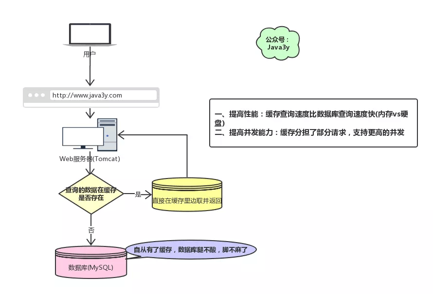

现在有个问题，如果我们的缓存挂掉了，这意味着我们的全部请求都跑去数据库了。

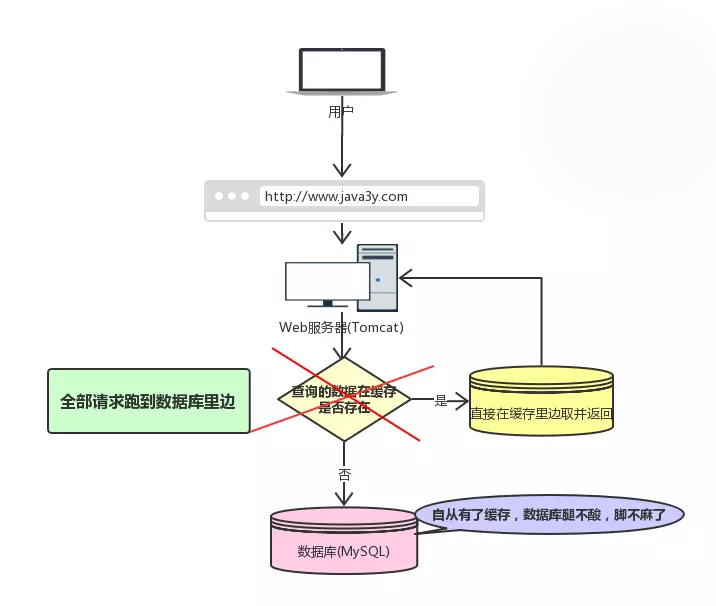

在前面学习我们都知道 Redis 不可能把所有的数据都缓存起来 (内存昂贵且有限)，所以 Redis 需要对数据设置过期时间，并采用的是惰性删除 + 定期删除两种策略对过期键删除。Redis 对过期键的策略 + 持久化
如果缓存数据设置的**过期时间是相同的**，并且 Redis 恰好将这部分数据全部删光了。这就会导致在这段时间内，这些缓存**同时失效**，全部请求到数据库中。

这就是缓存雪崩：

Redis 挂掉了，请求全部走数据库。
对缓存数据设置相同的过期时间，导致某段时间内缓存失效，请求全部走数据库。
缓存雪崩如果发生了，很可能就把我们的数据库搞垮，导致整个服务瘫痪！

#### 如何解决缓存雪崩？
对于 “对缓存数据设置相同的过期时间，导致某段时间内缓存失效，请求全部走数据库。” 这种情况，非常好解决：

解决方法：在缓存的时候给过期时间加上一个随机值，这样就会大幅度的减少缓存在同一时间过期。

对于 “Redis 挂掉了，请求全部走数据库” 这种情况，我们可以有以下的思路：

事发前：实现 Redis 的高可用 (主从架构 + Sentinel 或者 Redis Cluster)，尽量避免 Redis 挂掉这种情况发生。

事发中：万一 Redis 真的挂了，我们可以设置本地缓存 (ehcache)+ 限流 (hystrix)，尽量避免我们的数据库被干掉 (起码能保证我们的服务还是能正常工作的)

事发后：redis 持久化，重启后自动从磁盘上加载数据，快速恢复缓存数据。

### 
缓存穿透
 
比如，我们有一张数据库表，ID 都是从 1 开始的 (正数)：

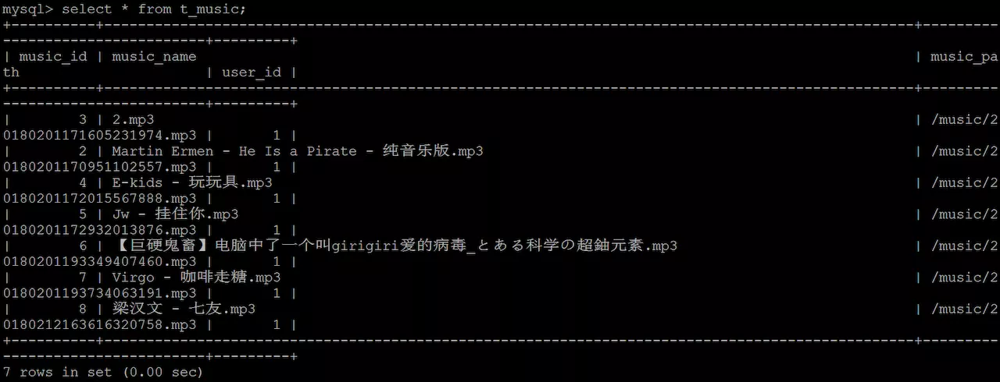

但是可能有黑客想把我的数据库搞垮，每次请求的 ID 都是负数。这会导致我的缓存就没用了，请求全部都找数据库去了，但数据库也没有这个值啊，所以每次都返回空出去。
>缓存穿透是指查询一个一定不存在的数据。由于缓存不命中，并且出于容错考虑，如果从数据库查不到数据则不写入缓存，这将导致这个不存在的数据每次请求都要到数据库去查询，失去了缓存的意义。

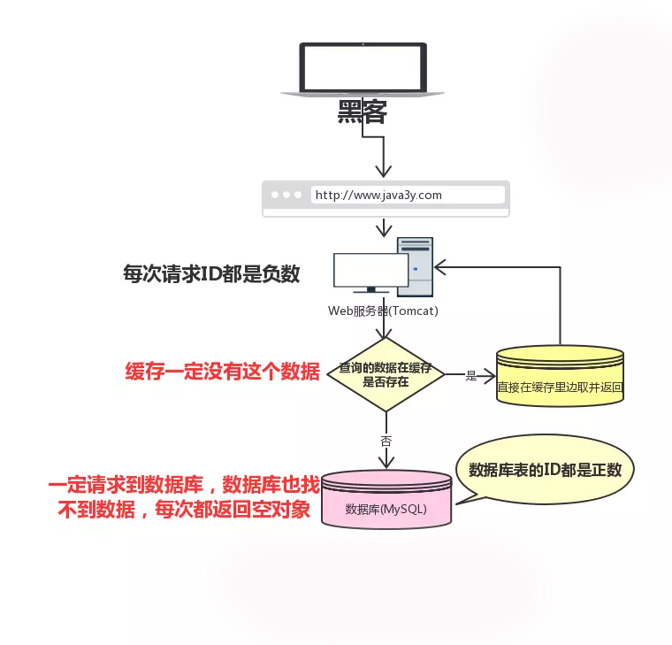

这就是缓存穿透：

请求的数据在缓存大量不命中，导致请求走数据库。
缓存穿透如果发生了，也可能把我们的数据库搞垮，导致整个服务瘫痪！

#### 如何解决缓存穿透？
解决缓存穿透也有两种方案：

由于请求的参数是不合法的 (每次都请求不存在的参数)，于是我们可以使用布隆过滤器 (BloomFilter) 或者压缩 filter 提前拦截，不合法就不让这个请求到数据库层！
当我们从数据库找不到的时候，我们也将这个空对象设置到缓存里边去。下次再请求的时候，就可以从缓存里边获取了。

这种情况我们一般会将空对象设置一个较短的过期时间。

##  
如何保证缓存与数据库的一致性
 
缓存穿透的时候也提到了：如果从数据库查不到数据则不写入缓存。
一般我们对读操作的时候有这么一个固定的套路：

- 如果我们的数据在缓存里边有，那么就直接取缓存的。
- 如果缓存里没有我们想要的数据，我们会先去查询数据库，然后将数据库查出来的数据写到缓存中。
- 最后将数据返回给请求

**什么是缓存与数据库双写一致问题？**
如果仅仅查询的话，缓存的数据和数据库的数据是没问题的。但是，当我们要更新时候呢？各种情况很可能就造成数据库和缓存的数据不一致了。

这里不一致指的是：数据库的数据跟缓存的数据不一致

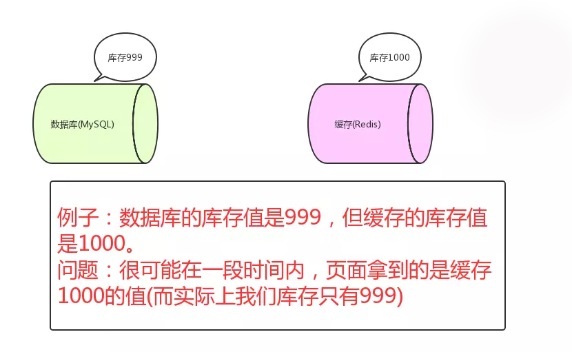

从理论上说，只要我们设置了键的过期时间，我们就能保证缓存和数据库的数据最终是一致的。因为只要缓存数据过期了，就会被删除。随后读的时候，因为缓存里没有，就可以查数据库的数据，然后将数据库查出来的数据写入到缓存中。
除了设置过期时间，我们还需要做更多的措施来尽量避免数据库与缓存处于不一致的情况发生。

#### 对于更新操作
一般来说，执行更新操作时，我们会有两种选择：

- 先操作数据库，再操作缓存
- 先操作缓存，再操作数据库

首先，要明确的是，无论我们选择哪个，我们都希望这两个操作要么同时成功，要么同时失败。所以，这会演变成一个分布式事务的问题。

所以，如果原子性被破坏了，可能会有以下的情况：

	* 操作数据库成功了，操作缓存失败了。
	* 操作缓存成功了，操作数据库失败了。
>如果第一步已经失败了，我们直接返回 Exception 出去就好了，第二步根本不会执行。

**操作缓存**
操作缓存也有两种方案：

1. 更新缓存
1. 删除缓存
一般我们都是采取删除缓存缓存策略的，原因如下：

>高并发环境下，无论是先操作数据库还是后操作数据库而言，如果加上更新缓存，那就更加容易导致数据库与缓存数据不一致问题。(删除缓存直接和简单很多)
如果每次更新了数据库，都要更新缓存【这里指的是频繁更新的场景，这会耗费一定的性能】，倒不如直接删除掉。等再次读取时，缓存里没有，那我到数据库找，在数据库找到再写到缓存里边 (体现懒加载)
基于这两点，对于缓存在更新时而言，都是建议执行删除操作！

##### 那么应该先操作数据库再删除缓存还是先删除缓存再操作数据库呢?

 **1 先更新数据库，再删除缓存**

正常的情况是这样的：

- 先操作数据库，成功；
- 再删除缓存，也成功；
如果原子性被破坏了：

- 第一步成功 (操作数据库)，第二步失败 (删除缓存)，会导致数据库里是新数据，而缓存里是旧数据。
- 如果第一步 (操作数据库) 就失败了，我们可以直接返回错误 (Exception)，不会出现数据不一致。

如果在高并发的场景下，出现数据库与缓存数据不一致的概率特别低，也不是没有：

- 缓存刚好失效
- 线程 A 查询数据库，得一个旧值
- 线程 B 将新值写入数据库
- 线程 B 删除缓存
- 线程 A 将查到的旧值写入缓存
要达成上述情况，还是说一句概率特别低：
>因为这个条件需要发生在读缓存时缓存失效，而且并发着有一个写操作。而实际上数据库的写操作会比读操作慢得多，而且还要锁表，而读操作必需在写操作前进入数据库操作，而又要晚于写操作更新缓存，所有的这些条件都具备的概率基本并不大。

###### 删除缓存失败的解决思路：

- 将需要删除的 key 发送到消息队列中
- 自己消费消息，获得需要删除的 key
- 不断重试删除操作，直到成功

 **2 先删除缓存，再更新数据库**
正常情况是这样的：

- 先删除缓存，成功；
- 再更新数据库，也成功；
如果原子性被破坏了：

- 第一步成功 (删除缓存)，第二步失败 (更新数据库)，数据库和缓存的数据还是一致的。
- 如果第一步 (删除缓存) 就失败了，我们可以直接返回错误 (Exception)，数据库和缓存的数据还是一致的。
- 
看起来是很美好，但是我们在并发场景下分析一下，就知道还是有问题的了：

- 线程 A 删除了缓存
- 线程 B 查询，发现缓存已不存在
- 线程 B 去数据库查询得到旧值
- 线程 B 将旧值写入缓存
- 线程 A 将新值写入数据库
所以也会导致数据库和缓存不一致的问题。

###### 并发下解决数据库与缓存不一致的思路：

将删除缓存、修改数据库、读取缓存等的操作积压到队列里边，实现串行化。

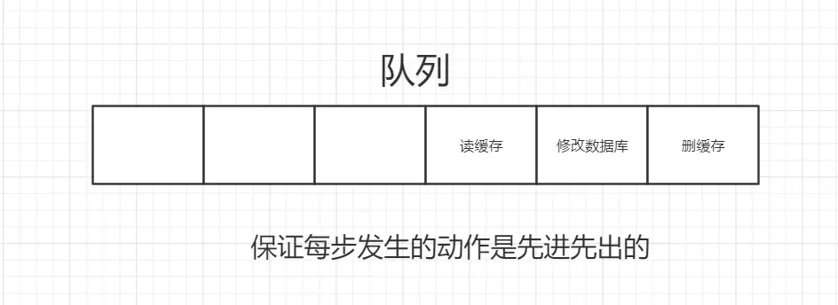

#### 对比两种策略
我们可以发现，两种策略各自有优缺点：

  * 先删除缓存，再更新数据库
    - 在高并发下表现不如意，在原子性被破坏时表现优异
  * 先更新数据库，再删除缓存 (Cache Aside Pattern 设计模式)
    - 在高并发下表现优异，在原子性被破坏时表现不如意

参考资料[Cache Aside Pattern](https://github.com/doocs/advanced-java/blob/master/docs/high-concurrency/redis-consistence.md)